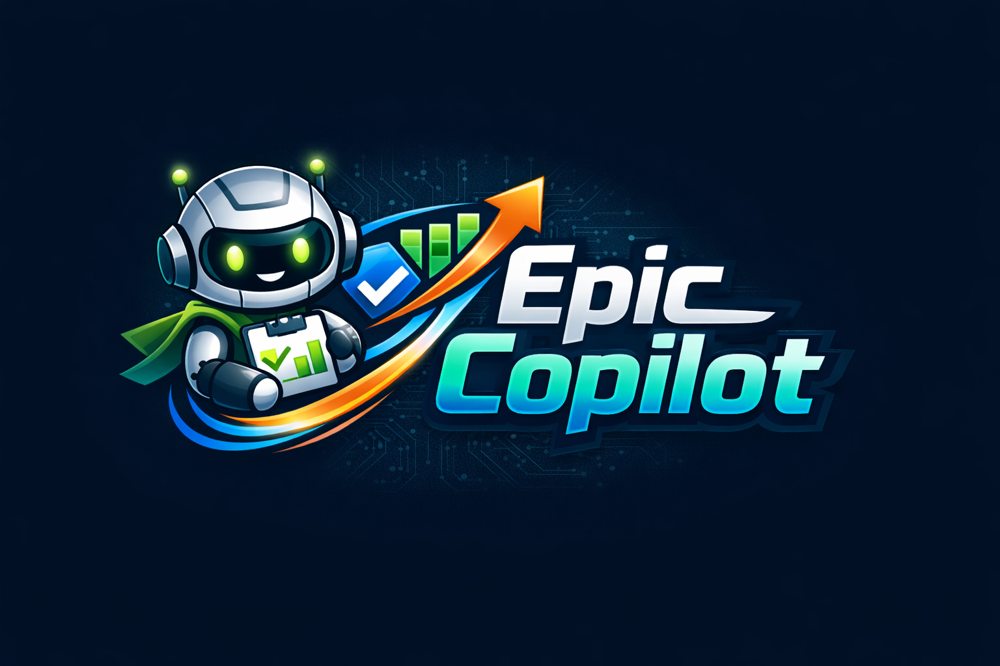
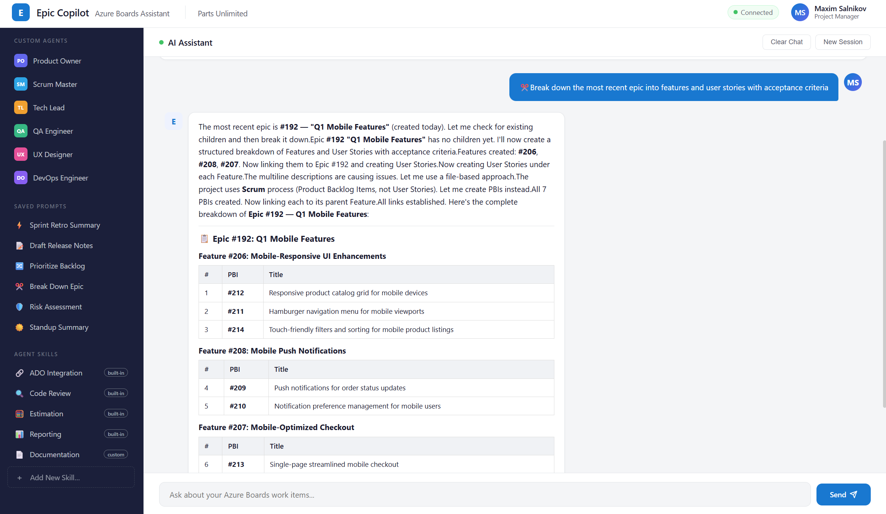
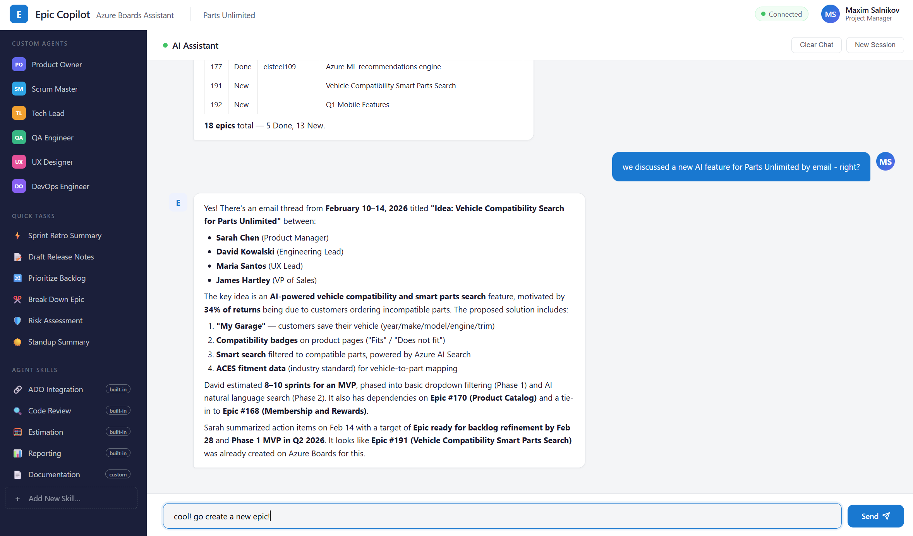

# Epic Copilot - AI-powered assistant for project managers, product owners, and delivery managers

<p align="center">
  
</p>

Epic Copilot is an AI-powered assistant that helps project managers, product owners, and delivery managers work in lockstep with developers. It operates in the same context and on the same underlying tools, enabling clearer communication and smoother collaboration across roles, powered by the GitHub Copilot SDK.

Built around Azure Boards, Epic Copilot brings together work item management and insights from your existing data such as emails, files, call summaries, and meeting notes. By combining the GitHub Copilot SDK with the Azure DevOps CLI today, and Azure DevOps MCP in the next version, along with Work IQ MCP, it turns information spread across Microsoft 365 into actionable work items, sprint plans, and up-to-date status reports using natural language.

## Features

- 🎯 Azure Boards work item management (create, update, query, link work items)
- 📊 Epic and user story planning
- 🔧 Sprint management and task tracking
- 🔍 Work item queries and reporting
- 💬 Natural language interactions with Azure DevOps
- 📧 Microsoft 365 data access (emails, meetings, files) via Work IQ MCP
- 🎨 Modern web UI with streaming responses

## Screenshots





## Prerequisites

Before setting up Epic Copilot, ensure you have the following installed and configured:

### 1. Node.js

- **Node.js 18 or higher** is required.
- Download from [nodejs.org](https://nodejs.org/) or use a version manager like `nvm`.
- Verify installation:
  ```bash
  node --version
  ```

### 2. GitHub Copilot Access

You must have an active **GitHub Copilot** subscription (Individual, Business, or Enterprise).

### 3. GitHub CLI Authentication

Install GitHub CLI and authenticate, as the Copilot SDK uses your GitHub identity:

```bash
# Install GitHub CLI: https://cli.github.com/
gh auth login
```

Follow the prompts to authenticate with your GitHub account. Verify with:

```bash
gh auth status
```

### 4. Azure CLI (Required)

**You must be logged in to the Azure CLI.** Epic Copilot uses the Azure DevOps MCP server to manage work items on Azure Boards, and authentication is handled via the Azure CLI.

#### Install Azure CLI

- **Windows**: Download from [aka.ms/installazurecliwindows](https://aka.ms/installazurecliwindows) or use winget:
  ```bash
  winget install -e --id Microsoft.AzureCLI
  ```
- **macOS**: `brew install azure-cli`
- **Linux**: Follow [Install Azure CLI on Linux](https://learn.microsoft.com/cli/azure/install-azure-cli-linux)

#### Log in to Azure

```bash
az login
```

This opens a browser window for authentication. After logging in, verify your session:

```bash
az account show
```

#### Install the Azure DevOps Extension

```bash
az extension add --name azure-devops
```

#### Configure Your Default Organization and Project

```bash
az devops configure --defaults organization=https://dev.azure.com/YOUR_ORG project=YOUR_PROJECT
```

Replace `YOUR_ORG` and `YOUR_PROJECT` with your Azure DevOps organization and project names.

> **Important**: If your Azure CLI session expires, Epic Copilot will fail to communicate with Azure Boards. Re-run `az login` to refresh your credentials.

### 5. Azure DevOps Personal Access Token (PAT) - will be used in the next version

The Azure DevOps MCP server requires a PAT for authentication. Create one at:

`https://dev.azure.com/YOUR_ORG/_usersSettings/tokens`

The PAT needs the following scopes:
- **Work Items**: Read & Write
- **Project and Team**: Read

Set the token as an environment variable:

```bash
# Windows (PowerShell)
$env:ADO_MCP_AUTH_TOKEN = "your-pat-token"

# macOS / Linux
export ADO_MCP_AUTH_TOKEN="your-pat-token"
```

For persistence, add it to your shell profile or use a `.env` file in the project root:

```
ADO_MCP_AUTH_TOKEN=your-pat-token
```

## Installation

```bash
git clone https://github.com/webmaxru/epic-copilot.git
cd epic-copilot
npm install
```

## Running the Application

Start the web server:

```bash
npm start
```

Then open your browser at: **http://localhost:3000**

For development with auto-reload:

```bash
npm run dev
```

## Building

Compile TypeScript to JavaScript:

```bash
npm run build
```

## Project Structure

```
epic-copilot/
├── src/
│   └── server.ts     # Express web server with Copilot SDK integration
├── public/
│   └── index.html    # Web UI for the chatbot
├── package.json
└── tsconfig.json
```

## Usage

Epic Copilot helps you manage Azure Boards work items through natural language:

### Example Commands

- "Create a new epic for the mobile app redesign"
- "List all user stories in the current sprint"
- "Show me high-priority bugs assigned to my team"
- "Generate a sprint burndown report"
- "Plan sprint work items for the next iteration"
- "What meetings do I have this week?" (via Work IQ)

## Technologies

- **Runtime**: Node.js, TypeScript
- **Web Framework**: Express
- **AI**: GitHub Copilot SDK
- **MCP Servers**: Work IQ MCP
- **Frontend**: Vanilla JavaScript, HTML5, CSS3

## Troubleshooting

| Problem | Solution |
|---------|----------|
| `az: command not found` | Install Azure CLI (see Prerequisites step 4) |
| `ERROR: AADSTS700082` | Azure CLI token expired — run `az login` again |
| `gh: command not found` | Install GitHub CLI: https://cli.github.com/ |
| `401 Unauthorized` from Azure DevOps | Check that `ADO_MCP_AUTH_TOKEN` is set and PAT has correct scopes |
| Server won't start | Ensure `node --version` is 18+ and `npm install` completed successfully |

## License

MIT
