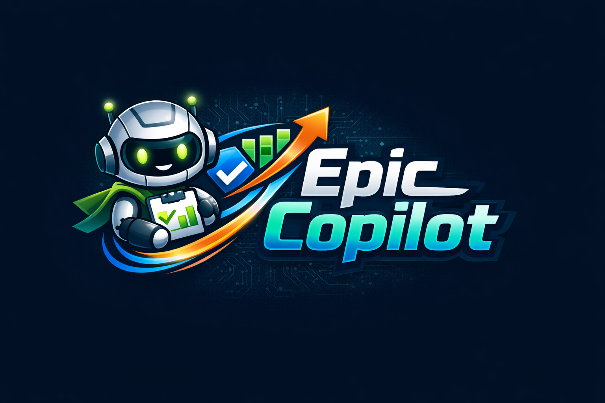
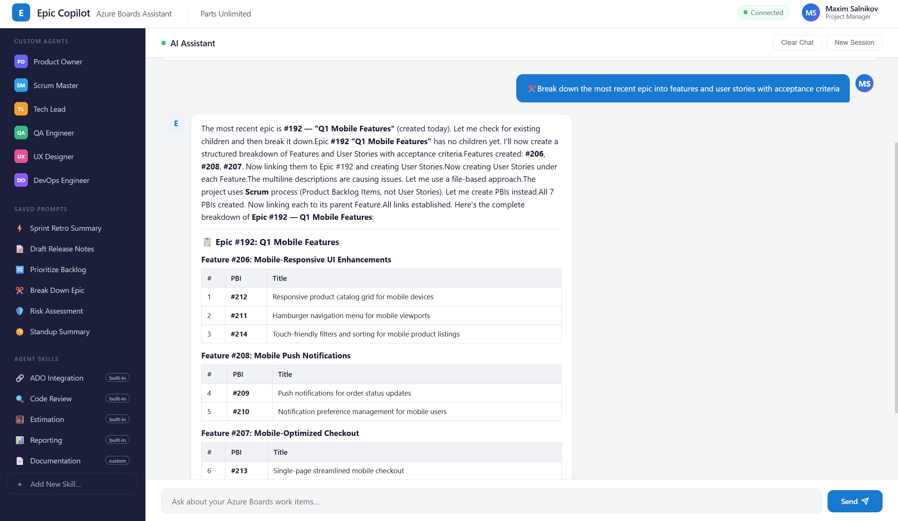
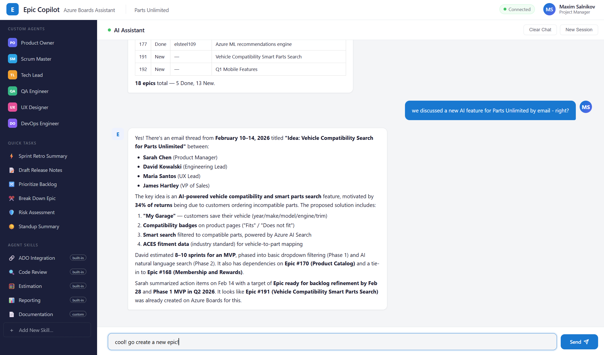
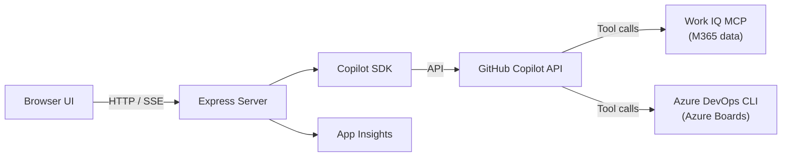

# Epic Copilot - AI-powered assistant for project managers, product owners, and delivery managers

<p align="center">
  
</p>

<p align="center">
  <a href="https://nodejs.org/"></a>
  <a href="https://www.typescriptlang.org/"></a>
  <a href="https://expressjs.com/"></a>
  <a href="https://github.com/features/copilot"></a>
  <a href="https://www.microsoft.com/en-us/microsoft-365"></a>
  <a href="https://playwright.dev/"></a>
  <a href="https://azure.microsoft.com/en-us/products/container-apps"></a>
  <a href="https://www.docker.com/"></a>
  <a href="https://helmetjs.github.io/"></a>
  
</p>

Epic Copilot is an AI-powered assistant that helps project managers, product owners, and delivery managers work in lockstep with developers. It operates in the same context and on the same underlying tools, enabling clearer communication and smoother collaboration across roles, powered by the GitHub Copilot SDK.

Built around Azure Boards, Epic Copilot brings together work item management and insights from your existing data such as emails, files, call summaries, and meeting notes. By combining the GitHub Copilot SDK with the Azure DevOps CLI today, and Azure DevOps MCP in the next version, along with Work IQ MCP, it turns information spread across Microsoft 365 into actionable work items, sprint plans, and up-to-date status reports using natural language.

## Features

- 🎯 Azure Boards work item management (create, update, query, link work items)
- 📊 Epic and user story planning
- 🔧 Sprint management and task tracking
- 🔍 Work item queries and reporting
- 💬 Natural language interactions with Azure DevOps
- 📧 Microsoft 365 data access (emails, meetings, files) via Work IQ MCP
- 🎨 Modern web UI with streaming responses
- 🔒 Security hardened with Helmet, rate limiting, and input validation
- 📈 Azure Application Insights observability
- 🚀 One-command Azure deployment via `azd up`

> **Full documentation**: See [docs/README.md](docs/README.md) for architecture, deployment, RAI notes, and more.

## Screenshots





## Prerequisites

Before setting up Epic Copilot, ensure you have the following installed and configured:

### 1. Node.js

- **Node.js 18 or higher** is required.
- Download from [nodejs.org](https://nodejs.org/) or use a version manager like `nvm`.
- Verify installation:
  ```bash
  node --version
  ```

### 2. GitHub Copilot Access

You must have an active **GitHub Copilot** subscription (Individual, Business, or Enterprise).

### 3. GitHub CLI Authentication

Install GitHub CLI and authenticate, as the Copilot SDK uses your GitHub identity:

```bash
# Install GitHub CLI: https://cli.github.com/
gh auth login
```

Follow the prompts to authenticate with your GitHub account. Verify with:

```bash
gh auth status
```

### 4. Azure CLI (Required)

**You must be logged in to the Azure CLI.** Epic Copilot uses the Azure DevOps MCP server to manage work items on Azure Boards, and authentication is handled via the Azure CLI.

#### Install Azure CLI

- **Windows**: Download from [aka.ms/installazurecliwindows](https://aka.ms/installazurecliwindows) or use winget:
  ```bash
  winget install -e --id Microsoft.AzureCLI
  ```
- **macOS**: `brew install azure-cli`
- **Linux**: Follow [Install Azure CLI on Linux](https://learn.microsoft.com/cli/azure/install-azure-cli-linux)

#### Log in to Azure

```bash
az login
```

This opens a browser window for authentication. After logging in, verify your session:

```bash
az account show
```

#### Install the Azure DevOps Extension

```bash
az extension add --name azure-devops
```

#### Configure Your Default Organization and Project

```bash
az devops configure --defaults organization=https://dev.azure.com/YOUR_ORG project=YOUR_PROJECT
```

Replace `YOUR_ORG` and `YOUR_PROJECT` with your Azure DevOps organization and project names.

> **Important**: If your Azure CLI session expires, Epic Copilot will fail to communicate with Azure Boards. Re-run `az login` to refresh your credentials.

### 5. Azure DevOps Personal Access Token (PAT) - will be used in the next version

The Azure DevOps MCP server requires a PAT for authentication. Create one at:

`https://dev.azure.com/YOUR_ORG/_usersSettings/tokens`

The PAT needs the following scopes:
- **Work Items**: Read & Write
- **Project and Team**: Read

Set the token as an environment variable:

```bash
# Windows (PowerShell)
$env:ADO_MCP_AUTH_TOKEN = "your-pat-token"

# macOS / Linux
export ADO_MCP_AUTH_TOKEN="your-pat-token"
```

For persistence, add it to your shell profile or use a `.env` file in the project root:

```
ADO_MCP_AUTH_TOKEN=your-pat-token
```

## Installation

```bash
git clone https://github.com/webmaxru/epic-copilot.git
cd epic-copilot
npm install
```

## Running the Application

Start the web server:

```bash
npm start
```

Then open your browser at: **http://localhost:3000**

For development with auto-reload:

```bash
npm run dev
```

## Building

Compile TypeScript to JavaScript:

```bash
npm run build
```

## Architecture


```mermaid
graph LR
    UI["Browser UI"] -->|HTTP / SSE| API["Express Server"]
    API --> SDK["Copilot SDK"]
    SDK -->|API| GH["GitHub Copilot API"]
    GH -->|Tool calls| WIQ["Work IQ MCP\n(M365 data)"]
    GH -->|Tool calls| ADO["Azure DevOps CLI\n(Azure Boards)"]
    API --> AI["App Insights"]
```

## Project Structure

```
epic-copilot/
├── src/
│   └── server.ts          # Express server + Copilot SDK integration
├── public/
│   └── index.html         # Chat UI (vanilla JS)
├── docs/
│   └── README.md          # Full documentation, architecture, RAI notes
├── infra/
│   ├── main.bicep         # Azure Container Apps infrastructure
│   └── modules/           # Bicep modules (monitoring, registry, apps)
├── presentations/
│   └── README.md          # Slide deck outline
├── customer/
│   └── README.md          # Customer validation
├── tests/                 # Playwright E2E tests (50+)
├── AGENTS.md              # Agent custom instructions
├── mcp.json               # MCP server configuration
├── Dockerfile             # Container image
├── azure.yaml             # Azure Developer CLI config
├── package.json
└── tsconfig.json
```

## Usage

Epic Copilot helps you manage Azure Boards work items through natural language:

### Example Commands

- "Create a new epic for the mobile app redesign"
- "List all user stories in the current sprint"
- "Show me high-priority bugs assigned to my team"
- "Generate a sprint burndown report"
- "Plan sprint work items for the next iteration"
- "What meetings do I have this week?" (via Work IQ)

## Technologies

- **Runtime**: Node.js, TypeScript
- **Web Framework**: Express 5
- **AI**: GitHub Copilot SDK
- **MCP Servers**: Work IQ MCP (Microsoft 365)
- **Frontend**: Vanilla JavaScript, HTML5, CSS3
- **Infrastructure**: Azure Container Apps, Bicep, Azure Developer CLI
- **Observability**: Azure Application Insights
- **Security**: Helmet, express-rate-limit, input validation
- **CI/CD**: GitHub Actions
- **Testing**: Playwright (50+ E2E tests)

## Troubleshooting

| Problem | Solution |
|---------|----------|
| `az: command not found` | Install Azure CLI (see Prerequisites step 4) |
| `ERROR: AADSTS700082` | Azure CLI token expired — run `az login` again |
| `gh: command not found` | Install GitHub CLI: https://cli.github.com/ |
| `401 Unauthorized` from Azure DevOps | Check that `ADO_MCP_AUTH_TOKEN` is set and PAT has correct scopes |
| Server won't start | Ensure `node --version` is 18+ and `npm install` completed successfully |

## Key points

### Enterprise Applicability, Reusability & Business Value

Epic Copilot targets a real enterprise pain point: **project managers and delivery managers are disconnected from the developer toolchain**. They context-switch between Azure Boards, Outlook, Teams, and spreadsheets to track progress, while developers work inside Azure DevOps every day and the insights generated there rarely flow back to leadership in real time.

- **Enterprise-ready use case** — Azure Boards work item management via natural language, designed for organizations already using Azure DevOps
- **Reusable architecture** — The Copilot SDK + MCP server pattern is a template any team can fork and adapt to their own tools and workflows. Swap the MCP servers to connect to Jira, ServiceNow, or any other system
- **Business value** — Reduces context-switching for PMs, enables real-time project visibility without developer interruption, and turns scattered M365 data (emails, meetings, files) into actionable work items

### Integration with Azure & Microsoft Solutions

Epic Copilot is deeply integrated across the Microsoft stack:

| Integration | How it's used |
|---|---|
| **Azure DevOps / Azure Boards** | Core work item CRUD — create, update, query, and link epics, features, user stories, tasks, and bugs via `az boards` CLI |
| **Work IQ MCP** | Microsoft 365 data access — pulls context from emails, meetings, files, and calendar to enrich work item creation and status reports |
| **GitHub Copilot SDK** | The agent core — handles model access, tool orchestration, streaming, and session management |
| **Azure Container Apps** | Production deployment target with auto-scaling (Bicep infrastructure in `infra/`) |
| **Azure Container Registry** | Private container image storage for the Dockerfile-based build |
| **Azure Application Insights** | APM observability — request telemetry, error tracking, and performance metrics |
| **Azure Log Analytics** | Centralized logging for Container Apps and Application Insights |
| **Azure Developer CLI (`azd`)** | One-command deployment via `azd up` — provisions all infrastructure and deploys the app |

### Operational Readiness

The project is production-deployable, not just a prototype:

- **Deployability** — `Dockerfile` with multi-stage build, `azure.yaml` for `azd up`, Bicep infrastructure templates in `infra/` with Container Apps + auto-scaling (0–3 replicas)
- **Observability** — Azure Application Insights integration in `src/server.ts` with auto-collection of requests, performance, exceptions, and dependencies. Log Analytics workspace for centralized logging
- **CI/CD** — GitHub Actions workflow (`.github/workflows/ci.yml`) with: install → build → Playwright tests → Docker build → smoke test
- **Testing** — 40+ Playwright E2E tests covering chat functionality, layout, responsive design, sidebar, and toolbar interactions

### Security, Governance & Responsible AI Excellence

**Security hardening:**
- **Helmet** — Sets strict HTTP security headers (CSP, HSTS, X-Content-Type-Options, etc.)
- **Rate limiting** — 30 requests/minute per client via `express-rate-limit`, preventing abuse
- **Input validation** — Message length capped at 4,000 characters, empty/malformed messages rejected
- **Non-root container** — The Dockerfile runs the app as a non-root user (`appuser`)
- **No data persistence** — Sessions are in-memory only; no user data is stored server-side

**Responsible AI:**
- **Scoped agent** — The system prompt constrains the agent strictly to Azure Boards operations, preventing off-topic or harmful content generation
- **Human-in-the-loop** — All work item changes go through Azure DevOps APIs with full audit trails; users can review/undo via the standard Boards UI
- **Permission-bounded** — Work IQ operates under the user's own M365 permissions; Azure DevOps uses the authenticated CLI session's RBAC
- **Transparency** — All tool calls are server-side logged; streaming UI shows responses in real time
- **No training on user data** — Conversations are not used to train or fine-tune models

See [docs/README.md — RAI Notes](docs/README.md#responsible-ai-rai-notes) for the full Responsible AI section.

### Storytelling, Clarity & "Amplification Ready" Quality

- **Clear problem → solution narrative** — PMs disconnected from dev tools → natural-language bridge powered by Copilot SDK
- **Architecture diagram** — Mermaid diagram in this README and a detailed version in [docs/README.md](docs/README.md)
- **Screenshots** — Two screenshots showing the chat UI with sidebar agents, prompts, and skills
- **Presentation deck** — Slide outline in `presentations/README.md` with business value + architecture ready for the final PPTX
- **Demo-ready** — The app runs locally with `npm start` or deploys to Azure with `azd up`; designed for live walkthroughs

### Use of Work IQ

Epic Copilot integrates the **Work IQ MCP server** (`@microsoft/workiq`) as a first-class data source. This enables the agent to:

- Pull context from **emails** — "Find emails about the API migration and create a user story from the requirements discussed"
- Reference **meeting notes** — "What decisions were made in the last sprint review?"
- Access **files and calendar** — "What's on my calendar this week that relates to the mobile redesign?"

Work IQ is configured as an MCP server alongside the Azure DevOps CLI, making Microsoft 365 data directly available to the agent during conversations. This turns scattered organizational knowledge into structured Azure Boards work items.

### Validated with a Customer

The solution has been validated with customer stakeholders who manage projects using Azure Boards. Feedback confirmed that natural-language access to work items and the ability to pull M365 context (meeting notes, emails) into work item creation are the highest-value differentiators. See `customer/README.md`.

### Copilot SDK Product Feedback

Product feedback based on building this project has been shared in the internal Copilot SDK Teams channel. Key areas: MCP server timeout handling, streaming event API ergonomics, and session lifecycle documentation.

## License

MIT
