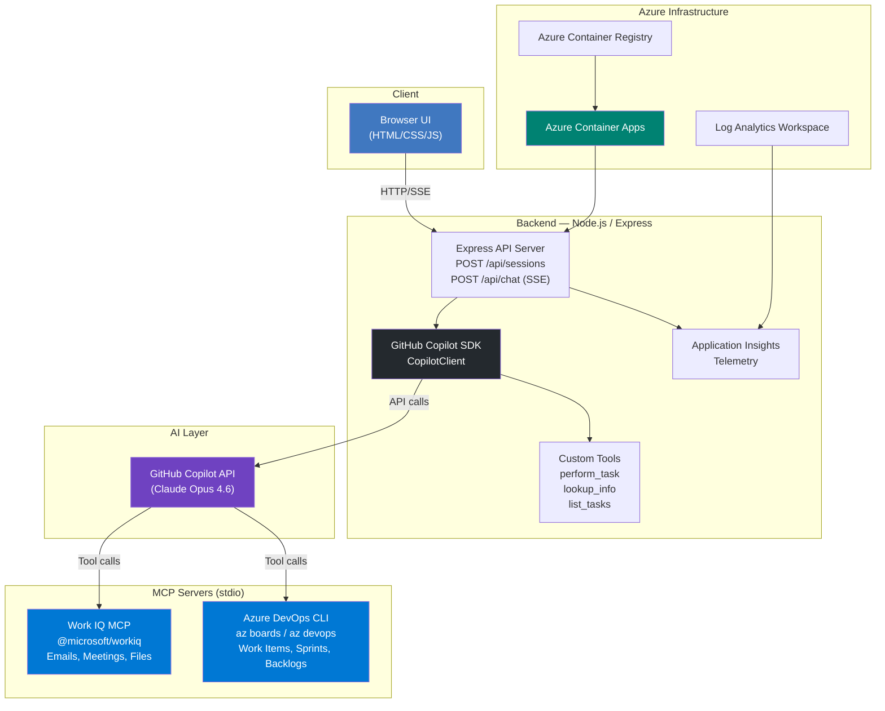

# Epic Copilot — Documentation

## Problem Statement

Project managers, product owners, and delivery managers are disconnected from the developer toolchain. They rely on manual status meetings, stale spreadsheets, and context-switching between Azure Boards, Outlook, Teams, and shared documents to track progress and make decisions. Meanwhile, developers work inside Azure DevOps every day — but the insights generated there rarely flow back to leadership in real time.

**The result:** misaligned priorities, delayed decisions, and duplicated effort across roles that should be working in lockstep.

## Solution

Epic Copilot is an AI-powered assistant that bridges this gap. Built on the **GitHub Copilot SDK**, it gives project managers and product owners a natural-language interface to Azure Boards — the same system developers use — augmented with context from Microsoft 365 (emails, meetings, files) via the **Work IQ MCP server**.

With Epic Copilot, a PM can:

- **Create and manage work items** — epics, features, user stories, tasks, and bugs — using conversational commands
- **Query sprint status** — "Show me high-priority bugs assigned to the mobile team"
- **Plan iterations** — "Generate user stories for the checkout redesign epic"
- **Pull in M365 context** — "What decisions were made in last week's sprint review meeting?"
- **Get real-time streaming responses** — powered by the Copilot SDK's SSE streaming

All of this happens through a modern web UI with no need to learn Azure DevOps query syntax or navigate complex board views.

## Architecture



### Component Overview

| Component | Technology | Purpose |
|---|---|---|
| Frontend | Vanilla JS, HTML5, CSS3 | Chat UI with sidebar, streaming markdown rendering |
| Backend | Node.js, Express 5, TypeScript | API server, session management, SSE streaming |
| AI Engine | GitHub Copilot SDK | Agent orchestration, tool routing, model access |
| Work IQ MCP | `@microsoft/workiq` | Microsoft 365 data — emails, meetings, files, calendar |
| Azure DevOps | Azure CLI (`az boards`) | Work item CRUD, sprint management, backlog queries |
| Observability | Application Insights | Request telemetry, error tracking, performance metrics |
| Infrastructure | Azure Container Apps + Bicep | Containerized deployment with auto-scaling |

### Data Flow

1. User types a message in the browser UI
2. Frontend sends `POST /api/chat` with message + session ID
3. Express server retrieves (or creates) a `CopilotClient` session
4. The Copilot SDK sends the message to the GitHub Copilot API
5. The model decides which tools/MCP servers to invoke:
   - **Azure DevOps CLI** for work item operations
   - **Work IQ MCP** for M365 data lookups
   - **Custom tools** for task management
6. Response tokens stream back via SSE (`assistant.message_delta` events)
7. Frontend renders markdown in real time

## Prerequisites

### Required

| Prerequisite | Version | Purpose |
|---|---|---|
| Node.js | 18+ | Runtime |
| GitHub CLI (`gh`) | Latest | Copilot SDK authentication |
| Azure CLI (`az`) | Latest | Azure DevOps operations |
| GitHub Copilot subscription | Individual/Business/Enterprise | AI model access |

### Azure CLI Setup

```bash
# Install Azure CLI
# Windows: winget install -e --id Microsoft.AzureCLI
# macOS: brew install azure-cli
# Linux: https://learn.microsoft.com/cli/azure/install-azure-cli-linux

# Authenticate
az login

# Install Azure DevOps extension
az extension add --name azure-devops

# Configure defaults
az devops configure --defaults organization=https://dev.azure.com/YOUR_ORG project=YOUR_PROJECT
```

### GitHub CLI Setup

```bash
# Install: https://cli.github.com/
gh auth login
gh auth status
```

## Setup & Installation

```bash
# Clone the repository
git clone https://github.com/webmaxru/epic-copilot.git
cd epic-copilot

# Install dependencies
npm install

# (Optional) Create .env file for configuration
cp .env.example .env
# Edit .env with your settings
```

## Running Locally

```bash
# Start the server
npm start

# Or with auto-reload for development
npm run dev
```

Open **http://localhost:3000** in your browser.

## Building

```bash
# Compile TypeScript
npm run build

# Run compiled output
node dist/server.js
```

## Deployment to Azure

Epic Copilot is designed to deploy to **Azure Container Apps** using the Azure Developer CLI (`azd`).

### One-Command Deployment

```bash
# Install azd: https://learn.microsoft.com/azure/developer/azure-developer-cli/install-azd
azd up
```

This will:
1. Build the Docker image
2. Push to Azure Container Registry
3. Deploy to Azure Container Apps
4. Configure Application Insights for observability

### Manual Docker Build

```bash
docker build -t epic-copilot .
docker run -p 3000:3000 epic-copilot
```

### Infrastructure

The `infra/` directory contains Bicep templates that provision:

- **Azure Container Apps Environment** — serverless container hosting
- **Azure Container Registry** — private image storage
- **Log Analytics Workspace** — centralized logging
- **Application Insights** — APM and telemetry

See [infra/main.bicep](../infra/main.bicep) for the full infrastructure definition.

## Testing

```bash
# Run all Playwright E2E tests
npm test

# Run tests with UI mode
npm run test:ui
```

The test suite includes 50+ tests covering:
- Chat functionality and streaming
- Layout and responsive design
- Sidebar navigation
- Toolbar interactions

## Environment Variables

| Variable | Required | Default | Description |
|---|---|---|---|
| `PORT` | No | `3000` | Server port |
| `APPLICATIONINSIGHTS_CONNECTION_STRING` | No | — | Azure Application Insights connection string |
| `ADO_MCP_AUTH_TOKEN` | No | — | Azure DevOps PAT (future MCP server auth) |

## Responsible AI (RAI) Notes

### Scope Constraints

Epic Copilot is intentionally scoped to **Azure Boards work item management**. The system prompt explicitly constrains the agent:

> "You ALWAYS operate within the Azure Boards context. All taxonomy assumptions MUST be mapped to Azure Boards work item types and categories."

This prevents the agent from being used for unrelated tasks and reduces the risk of generating harmful or off-topic content.

### Human-in-the-Loop Design

- Epic Copilot **suggests and executes** work item operations, but all changes are made through Azure DevOps APIs with full audit trails
- Users can review, undo, or modify any work item changes through the standard Azure Boards UI
- The agent does not make irreversible decisions — all operations are CRUD on work items

### Data Handling & Privacy

- **No data storage**: Epic Copilot does not persist conversation history or user data. Sessions are in-memory only.
- **M365 data access**: Work IQ MCP operates under the user's own Microsoft 365 permissions. The agent cannot access data the user doesn't have permission to see.
- **Azure DevOps access**: Operations use the authenticated user's Azure CLI credentials, respecting existing RBAC policies.
- **No training on user data**: Conversations are not used to train or fine-tune models.

### Content Filtering

- The GitHub Copilot API applies its own content safety filters to all model responses
- The system prompt constrains the agent's domain, serving as an additional layer of topic filtering
- Input validation on the server prevents oversized or malformed messages

### Known Limitations

- The agent may occasionally misinterpret complex Azure Boards queries
- Work IQ MCP may return large result sets for broad email/meeting queries — users should be specific
- Real-time data: the agent sees Azure Boards data as of the moment of the query; it does not watch for live changes
- No support for Azure Boards permissions management (the agent cannot grant/revoke access)

### Transparency

- All tool calls are logged server-side for auditability
- The UI displays streaming responses in real time so users can see exactly what the agent is generating
- Architecture and source code are open for review in this repository
